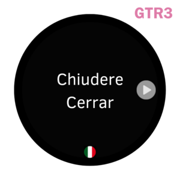

# Words - Language Learning On Your Wrist!

## Overview
Introducing **Words**, the smartwatch app designed to boost your vocabulary on the go. Every time you open the app, a fresh word from your target language appears along with its translation. It's a seamless way to integrate language learning into your daily routine.

## Features

- **Fresh Word Every Open**: Always presents a new word every time, ensuring variety.
  
- **Example Sentences**: Contextualize your learning with real-world usage examples.

- **Single Direction Learning**: No going back, so make sure to remember the word! This promotes repetition and reinforces memory.

- **Customizable**: Choose your native language, target language, and difficulty level.

## Interface

  

    
    
Main Display

  

  

    
    
Example Display

  

## Coming Soon

While Words is currently in development for Zepp OS, plans are underway to expand its availability to other operating systems such as WatchOS and WearOS.

## Feedback & Suggestions

We're always looking to improve! If you have ideas or feedback, please let us know.

## Stay Tuned

Keep an eye out for the official release and immerse yourself in a new language, one word at a time.
